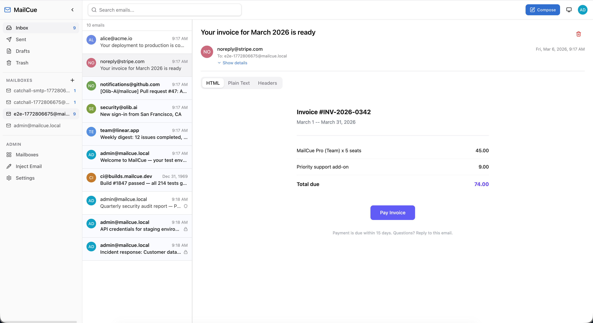
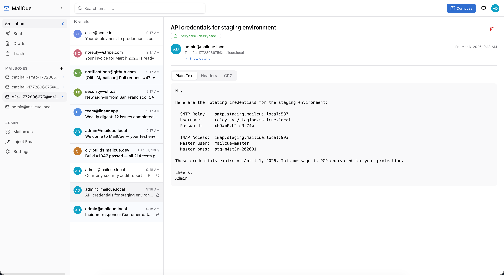
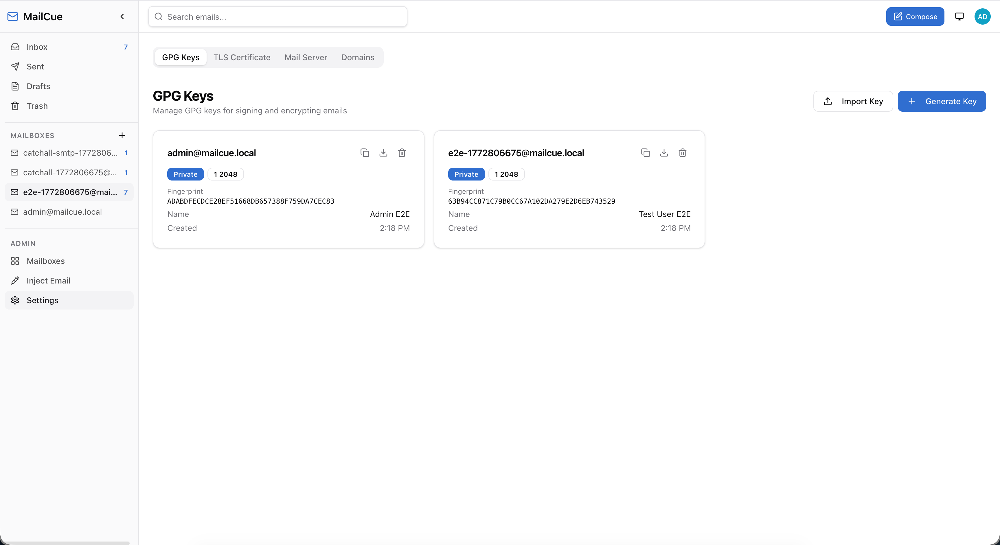

<p align="center">
  <br />
  
  <br />
  <em>A realistic email testing server in a single Docker container.</em>
  <br /><br />
  <a href="https://github.com/Olib-AI/mailcue/actions"></a>
  <a href="https://github.com/Olib-AI/mailcue/blob/main/LICENSE"></a>
  <a href="https://hub.docker.com/r/olibakram/mailcue"></a>
  <a href="https://www.olib.ai"></a>
</p>

---

MailCue is an all-in-one email testing server that packages **Postfix**, **Dovecot**, **OpenDKIM**, **OpenDMARC**, **SpamAssassin**, a **FastAPI** REST API, and a **React** web UI into a single Docker container managed by **s6-overlay**. Unlike simple SMTP catchers, MailCue provides a fully-featured mail stack -- complete with IMAP/POP3 access, DKIM signing, DMARC verification, spam filtering, TLS, GPG encryption, and a modern web interface -- so you can test email workflows exactly as they will behave in production.

<p align="center">
  
</p>
<p align="center">
  
</p>
<p align="center">
  
</p>

## Features

| Category | What you get |
|---|---|
| **Catch-all SMTP** | Accepts mail for *any* address on *any* domain. Nothing leaves the container. |
| **Full IMAP & POP3** | Read captured emails with any standard client (Thunderbird, mutt, your own code). |
| **Modern Web UI** | Responsive React app with mailbox sidebar, folder navigation, rich email viewer, and compose dialog. |
| **REST API** | Complete JSON API for sending, receiving, injecting, searching, and deleting emails -- ideal for CI pipelines. |
| **Email Injection** | Bypass SMTP entirely -- insert emails directly into mailboxes via IMAP APPEND for deterministic test setup. |
| **Bulk Injection** | Seed mailboxes with hundreds of test emails in a single API call. |
| **Realistic Headers** | Injected emails include multi-hop Received chains, Authentication-Results, ARC headers (RFC 8617), simulated DKIM-Signature, Return-Path, X-Mailer, and threading headers (In-Reply-To, References). Indistinguishable from production email. |
| **DKIM Signing** | Automatic DKIM key generation and signing via OpenDKIM so you can validate DKIM verification logic. |
| **DMARC Verification** | OpenDMARC milter verifies DMARC alignment on inbound mail and adds Authentication-Results headers. |
| **SPF Checking** | Inbound SPF verification via postfix-policyd-spf-python with results available in Authentication-Results. |
| **Spam Filtering** | SpamAssassin (spamd) scores inbound messages. Configurable threshold with Bayesian filtering and RBL checks. |
| **MTA-STS & TLS-RPT** | Serves MTA-STS policy (RFC 8461) at `/.well-known/mta-sts.txt` and provides TLS-RPT (RFC 8460) DNS record guidance. |
| **TLS Everywhere** | Auto-generated self-signed certificates for SMTP STARTTLS, IMAPS (993), POP3S (995). Upload your own certs from the UI. |
| **GPG / PGP-MIME** | Generate, import, and manage GPG keys per mailbox. Sign, encrypt, verify, and decrypt emails (RFC 3156). Publish public keys to `keys.openpgp.org`. |
| **Real-time Events** | Server-Sent Events (SSE) stream pushes `email.received`, `email.deleted`, `mailbox.created`, and more. |
| **Two-Factor Auth** | TOTP-based 2FA with authenticator app support. Setup wizard with QR code in the profile page. |
| **API Keys** | Programmatic `X-API-Key` authentication for CI/CD and automation alongside JWT for the web UI. Manage keys from the profile page. |
| **Domain Management** | Add custom email domains with automatic DKIM key generation. DNS verification dashboard for MX, SPF, DKIM, DMARC, MTA-STS, and TLS-RPT records. |
| **Smarthost Relay** | Optional outbound relay via external SMTP services (SendGrid, Mailgun, AWS SES) when port 25 is blocked. Configured via `MAILCUE_RELAY_*` env vars. |
| **Server Configuration** | Configure server hostname and upload custom TLS certificates from the admin UI. Certs persist across container restarts. |
| **Admin Panel** | Create and delete mailboxes, inject test emails, manage domains, configure mail server -- all from the browser. |
| **Single Container** | One `docker run` command. No external databases, no Redis, no message queues. |
| **Persistent Storage** | SQLite (with optional SQLCipher AES-256 encryption) and Maildir storage survive container restarts via Docker volumes. |

## Tech Stack

### Backend

- **Python 3.12** with **FastAPI** and **Uvicorn** (async)
- **SQLAlchemy 2** (async) + **aiosqlite** (SQLite by default, swappable to PostgreSQL)
- **Alembic** for database migrations
- **Argon2id** password hashing, **JWT** (HS256) authentication
- **aioimaplib** and **aiosmtplib** for async IMAP/SMTP operations
- **python-gnupg** for GPG key management and PGP/MIME operations
- **sse-starlette** for Server-Sent Events

### Frontend

- **React 19** with **TypeScript**
- **Vite 6** build tool with SWC
- **Tailwind CSS 4** for styling
- **TanStack React Query** for server-state management
- **React Router 7** for client-side routing
- **Tiptap** rich text editor for composing HTML emails
- **Zustand** for UI state
- **Zod** + **React Hook Form** for validation

### Infrastructure

- **Postfix** -- SMTP server (ports 25 and 587)
- **Dovecot** -- IMAP/POP3/LMTP server (ports 143, 993, 110, 995)
- **OpenDKIM** -- DKIM signing and verification
- **OpenDMARC** -- DMARC policy verification (milter)
- **SpamAssassin** -- Spam scoring and filtering
- **postfix-policyd-spf-python** -- SPF record verification
- **Nginx** -- Reverse proxy and static file server
- **s6-overlay v3** -- Process supervisor (PID 1)
- **SQLCipher** -- Optional AES-256 database encryption (drop-in SQLite replacement)
- **Debian Bookworm** slim base image

## Architecture

```
                          +------- Single Docker Container -------+
                          |                                        |
  Port 80 ───────────────>|  Nginx                                 |
    /api/* ──────────────>|    ├── proxy_pass ──> Uvicorn (:8000)  |
    /* (SPA) ────────────>|    └── static files (/var/www/mailcue) |
                          |                                        |
  Port 25 ───────────────>|  Postfix (SMTP inbound)                |
  Port 587 ──────────────>|  Postfix (Submission w/ STARTTLS+AUTH) |
                          |    └── LMTP ──> Dovecot                |
                          |    └── milter ──> OpenDKIM             |
                          |    └── milter ──> OpenDMARC            |
                          |                                        |
  Port 143 / 993 ────────>|  Dovecot (IMAP / IMAPS)               |
  Port 110 / 995 ────────>|  Dovecot (POP3 / POP3S)               |
                          |                                        |
                          |  SQLite (/var/lib/mailcue/mailcue.db)  |
                          |  Maildir (/var/mail/vhosts/)           |
                          |  GPG keyring (/var/lib/mailcue/gpg/)   |
                          +----------------------------------------+
```

**Request flow:** Nginx serves the React SPA for all non-API routes and proxies `/api/*` to Uvicorn. The FastAPI backend talks to Dovecot via IMAP (using a master-user credential for mailbox impersonation) and to Postfix via local SMTP. All services are supervised by s6-overlay, which handles startup ordering and automatic restarts.

## Quick Start

### Docker Compose (recommended)

```bash
git clone https://github.com/Olib-AI/mailcue.git
cd mailcue
docker compose up -d
```

Open **http://localhost:8088** and log in with:
- **Username:** `admin`
- **Password:** `mailcue`

### Docker Run

```bash
docker run -d \
  --name mailcue \
  -p 8088:80 \
  -p 25:25 \
  -p 587:587 \
  -p 143:143 \
  -p 993:993 \
  -v mailcue-data:/var/mail/vhosts \
  -v mailcue-db:/var/lib/mailcue \
  -e MAILCUE_DOMAIN=mailcue.local \
  -e MAILCUE_ADMIN_PASSWORD=mailcue \
  olibakram/mailcue
```

### Verify It Works

```bash
# Health check
curl http://localhost:8088/api/v1/health

# Send a test email via SMTP
echo "Subject: Hello" | sendmail -S localhost user@mailcue.local

# Or inject via the API
curl -X POST http://localhost:8088/api/v1/emails/inject \
  -H "Authorization: Bearer <token>" \
  -H "Content-Type: application/json" \
  -d '{
    "mailbox": "admin@mailcue.local",
    "from_address": "test@example.com",
    "to_addresses": ["admin@mailcue.local"],
    "subject": "Hello from the API",
    "html_body": "<h1>It works!</h1>"
  }'
```

## Development Setup

### Prerequisites

- **Docker** (for the full stack) or:
- **Python 3.12+** and **Node.js 22+** (for local development)

### Backend (local)

```bash
cd backend
python3 -m venv .venv
source .venv/bin/activate
pip install -e ".[dev]"

# Run with auto-reload (requires a running mail server or mock)
uvicorn app.main:app --reload --port 8000
```

### Frontend (local)

```bash
cd frontend
npm install
npm run dev          # Starts Vite dev server on :3000
                     # Proxies /api/* to localhost:8000
```

### Linting & Type Checking

```bash
# Backend
cd backend
ruff check .         # Linting
ruff format .        # Formatting
mypy .               # Type checking

# Frontend
cd frontend
npm run lint         # ESLint
npm run typecheck    # TypeScript
```

### Running Tests

```bash
cd backend
pytest               # Runs async tests with pytest-asyncio
```

## Configuration

All settings are configured via environment variables prefixed with `MAILCUE_`. A `.env` file is also supported.

| Variable | Default | Description |
|---|---|---|
| `MAILCUE_DOMAIN` | `mailcue.local` | Primary email domain (e.g., `user@<domain>`) |
| `MAILCUE_HOSTNAME` | `mail.mailcue.local` | SMTP/IMAP hostname for TLS certificates |
| `MAILCUE_ADMIN_USER` | `admin` | Default admin username |
| `MAILCUE_ADMIN_PASSWORD` | `mailcue` | Default admin password |
| `MAILCUE_SECRET_KEY` | *(auto-generated)* | JWT signing key. Leave empty for auto-generation on first boot. |
| `MAILCUE_DB_PATH` | `/var/lib/mailcue/mailcue.db` | SQLite database file path |
| `MAILCUE_DATABASE_URL` | `sqlite+aiosqlite:///...` | Full database URL (override for PostgreSQL) |
| `MAILCUE_SMTP_HOST` | `127.0.0.1` | SMTP server address (internal) |
| `MAILCUE_SMTP_PORT` | `25` | SMTP server port (internal) |
| `MAILCUE_IMAP_HOST` | `127.0.0.1` | IMAP server address (internal) |
| `MAILCUE_IMAP_PORT` | `143` | IMAP server port (internal) |
| `MAILCUE_IMAP_MASTER_USER` | `mailcue-master` | Dovecot master user for API impersonation |
| `MAILCUE_IMAP_MASTER_PASSWORD` | `master-secret` | Dovecot master user password |
| `MAILCUE_GPG_HOME` | `/var/lib/mailcue/gpg` | GnuPG keyring directory |
| `MAILCUE_ACCESS_TOKEN_EXPIRE_MINUTES` | `30` | JWT access token lifetime |
| `MAILCUE_REFRESH_TOKEN_EXPIRE_DAYS` | `7` | JWT refresh token lifetime |
| `MAILCUE_DATABASE_ENCRYPTION_KEY` | *(empty)* | SQLCipher encryption key. Set for AES-256 database encryption. |
| `MAILCUE_RELAY_HOST` | *(empty)* | Smarthost relay hostname (e.g., `smtp.sendgrid.net`) |
| `MAILCUE_RELAY_PORT` | `587` | Smarthost relay port |
| `MAILCUE_RELAY_USER` | *(empty)* | Smarthost SASL username |
| `MAILCUE_RELAY_PASSWORD` | *(empty)* | Smarthost SASL password |
| `MAILCUE_CORS_ORIGINS` | `["*"]` | Allowed CORS origins (JSON array) |
| `MAILCUE_DEBUG` | `false` | Enable debug logging |

## Exposed Ports

| Port | Protocol | Description |
|---|---|---|
| **80** | HTTP | Web UI + API (Nginx reverse proxy) |
| **25** | SMTP | Inbound mail (MTA-to-MTA, no auth required) |
| **587** | SMTP | Submission (STARTTLS + SASL authentication) |
| **143** | IMAP | IMAP with STARTTLS |
| **993** | IMAPS | IMAP over implicit TLS |
| **110** | POP3 | POP3 with STARTTLS |
| **995** | POP3S | POP3 over implicit TLS |

## API Reference

The API is served under `/api/v1` and documented with interactive Swagger UI at `/api/docs`.

### Authentication

```
POST /api/v1/auth/login          # Username + password -> JWT tokens
POST /api/v1/auth/login/2fa      # Complete login with TOTP code
POST /api/v1/auth/refresh         # Refresh token rotation
POST /api/v1/auth/logout          # Clear refresh cookie
GET  /api/v1/auth/me              # Current user profile
POST /api/v1/auth/register        # Create user (admin only)
PUT  /api/v1/auth/password        # Change password
POST /api/v1/auth/totp/setup      # Generate TOTP secret + QR code
POST /api/v1/auth/totp/confirm    # Verify code and enable 2FA
POST /api/v1/auth/totp/disable    # Disable 2FA
POST /api/v1/auth/api-keys        # Generate API key
GET  /api/v1/auth/api-keys        # List API keys
DELETE /api/v1/auth/api-keys/:id  # Revoke API key
```

Authenticate with either:
- `Authorization: Bearer <jwt>` header
- `X-API-Key: mc_...` header

### Emails

```
GET    /api/v1/emails              # List emails (paginated, searchable)
GET    /api/v1/emails/:uid         # Get email detail (full body + headers)
GET    /api/v1/emails/:uid/raw     # Download raw .eml file
GET    /api/v1/emails/:uid/attachments/:part_id  # Download attachment
POST   /api/v1/emails/send         # Send via SMTP (with optional GPG sign/encrypt)
POST   /api/v1/emails/inject       # Inject directly via IMAP APPEND
POST   /api/v1/emails/bulk-inject  # Batch inject multiple emails
DELETE /api/v1/emails/:uid         # Delete email
```

### Mailboxes

```
GET    /api/v1/mailboxes                          # List all mailboxes with counts
POST   /api/v1/mailboxes                          # Create mailbox (admin only)
DELETE /api/v1/mailboxes/:address                  # Delete mailbox (admin only)
GET    /api/v1/mailboxes/:id/stats                 # Folder statistics
GET    /api/v1/mailboxes/:address/emails           # List emails in mailbox
GET    /api/v1/mailboxes/:address/emails/:uid      # Get specific email
DELETE /api/v1/mailboxes/:address/emails/:uid      # Delete specific email
```

### GPG Keys

```
POST   /api/v1/gpg/keys/generate    # Generate RSA or ECC keypair
POST   /api/v1/gpg/keys/import      # Import armored PGP key
GET    /api/v1/gpg/keys              # List all keys
GET    /api/v1/gpg/keys/:address     # Get key by mailbox address
GET    /api/v1/gpg/keys/:address/export      # Export public key (JSON)
GET    /api/v1/gpg/keys/:address/export/raw  # Download .asc file
POST   /api/v1/gpg/keys/:address/publish   # Publish to keys.openpgp.org
DELETE /api/v1/gpg/keys/:address          # Delete keys for address
```

### Domains

```
GET    /api/v1/domains                    # List managed domains (admin only)
POST   /api/v1/domains                    # Add domain + generate DKIM (admin only)
GET    /api/v1/domains/:name              # Domain details with DNS records
DELETE /api/v1/domains/:name              # Remove domain (admin only)
POST   /api/v1/domains/:name/verify-dns   # Run live DNS verification
GET    /.well-known/mta-sts.txt            # MTA-STS policy (RFC 8461, no auth)
```

### System

```
GET  /api/v1/system/certificate           # TLS certificate metadata (no auth)
GET  /api/v1/system/certificate/download  # Download PEM certificate (no auth)
GET  /api/v1/system/settings              # Server settings (admin only)
PUT  /api/v1/system/settings              # Update server settings (admin only)
GET  /api/v1/system/tls                   # Custom TLS cert status (admin only)
PUT  /api/v1/system/tls                   # Upload custom TLS cert (admin only)
```

### Events & Health

```
GET  /api/v1/events/stream    # SSE stream (real-time notifications)
GET  /api/v1/health           # Health check endpoint
```

**SSE event types:** `email.received`, `email.sent`, `email.deleted`, `mailbox.created`, `mailbox.deleted`, `heartbeat`

## Using with Email Clients

MailCue works with any standard email client. Configure your client with:

| Setting | Value |
|---|---|
| **IMAP Server** | `localhost` (port 143 or 993 for SSL) |
| **POP3 Server** | `localhost` (port 110 or 995 for SSL) |
| **SMTP Server** | `localhost` (port 587, STARTTLS) |
| **Username** | `admin@mailcue.local` (or any created mailbox) |
| **Password** | Your mailbox password |
| **Security** | Accept the self-signed certificate |

## TLS Certificate

MailCue generates a self-signed TLS certificate at container startup for Postfix, Dovecot, and Nginx. Any application connecting to MailCue over TLS (mail clients, SMTP relays, CI pipelines) must trust this certificate. You can download it from the Admin UI (**Admin > TLS Certificate** tab) or via the API:

```bash
curl -o mailcue-ca.crt http://localhost:8088/api/v1/system/certificate/download
```

Then install it in your system trust store:

**macOS**

```bash
sudo security add-trusted-cert -d -r trustRoot \
  -k /Library/Keychains/System.keychain mailcue-ca.crt
```

Or double-click the file to open Keychain Access and set it to "Always Trust".

**Linux (Debian/Ubuntu)**

```bash
sudo cp mailcue-ca.crt /usr/local/share/ca-certificates/
sudo update-ca-certificates
```

**Linux (RHEL/Fedora)**

```bash
sudo cp mailcue-ca.crt /etc/pki/ca-trust/source/anchors/
sudo update-ca-trust
```

**Windows**

```powershell
certutil -addstore -f "ROOT" mailcue-ca.crt
```

Or double-click the file and install to "Trusted Root Certification Authorities".

**Docker / CI Pipelines**

```dockerfile
RUN curl -o /usr/local/share/ca-certificates/mailcue-ca.crt \
      http://<mailcue-host>/api/v1/system/certificate/download \
    && update-ca-certificates
```

## Using in CI/CD

MailCue is designed for automated testing pipelines:

```yaml
# GitHub Actions example
services:
  mailcue:
    image: olibakram/mailcue
    ports:
      - 8088:80
      - 25:25
      - 143:143

steps:
  - name: Wait for MailCue
    run: |
      until curl -sf http://localhost:8088/api/v1/health; do sleep 1; done

  - name: Run email tests
    run: npm test
    env:
      SMTP_HOST: localhost
      SMTP_PORT: 25
      MAILCUE_API: http://localhost:8088/api/v1
```

Use API keys for non-interactive authentication:

```bash
# Create an API key
TOKEN=$(curl -s -X POST http://localhost:8088/api/v1/auth/login \
  -H "Content-Type: application/json" \
  -d '{"username":"admin","password":"mailcue"}' | jq -r .access_token)

API_KEY=$(curl -s -X POST http://localhost:8088/api/v1/auth/api-keys \
  -H "Authorization: Bearer $TOKEN" \
  -H "Content-Type: application/json" \
  -d '{"name":"ci-pipeline"}' | jq -r .key)

# Use the API key in subsequent requests
curl -H "X-API-Key: $API_KEY" http://localhost:8088/api/v1/emails?mailbox=admin@mailcue.local
```

## Messaging Sandbox

MailCue includes a messaging sandbox that emulates the APIs of **Telegram**, **Slack**, **Mattermost**, and **Twilio**. Point your app at MailCue's sandbox endpoints instead of the real provider and all messages are captured locally. Webhooks fire in each provider's exact payload format with proper signatures.

- Create provider instances via the UI or API (`/api/v1/sandbox/providers`)
- Simulate inbound messages (provider → your app) and send outbound messages (your app → provider, triggers webhooks)
- Configure webhook endpoints per provider with automatic retry and exponential backoff
- Provider-native authentication on sandbox routes (bot token in URL for Telegram, Bearer for Slack/Mattermost, HTTP Basic for Twilio)

## HTTP Bin

A built-in request inspector at `/http-bin` in the UI. Create bins, point webhooks or any HTTP client at the bin URL, and inspect every captured request -- method, headers, query params, and body -- in real time. Useful for verifying webhook payloads without leaving MailCue.

## Contributing

Contributions are welcome! Please:

1. Fork the repository
2. Create a feature branch (`git checkout -b feature/my-feature`)
3. Make your changes
4. Run linters and tests:
   ```bash
   # Backend
   cd backend && ruff check . && ruff format --check . && mypy .

   # Frontend
   cd frontend && npm run lint && npm run typecheck
   ```
5. Commit your changes (`git commit -m "Add my feature"`)
6. Push to your fork (`git push origin feature/my-feature`)
7. Open a Pull Request

### Development Principles

- Backend code uses strict typing (`mypy --strict`) and follows the Ruff linter rules.
- Frontend code is TypeScript-first with ESLint enforced.
- All API endpoints follow RESTful conventions and return consistent JSON error envelopes.
- New features should include appropriate SSE events for real-time UI updates.

## License

This project is licensed under the [MIT License](LICENSE).

## Links

- **Olib AI** -- [www.olib.ai](https://www.olib.ai)
- **GitHub** -- [github.com/Olib-AI/mailcue](https://github.com/Olib-AI/mailcue)
- **API Docs** -- Available at `/api/docs` when running
- **Issues** -- [github.com/Olib-AI/mailcue/issues](https://github.com/Olib-AI/mailcue/issues)

---

<p align="center">
  Built with care by <a href="https://www.olib.ai">Olib AI</a>
</p>
