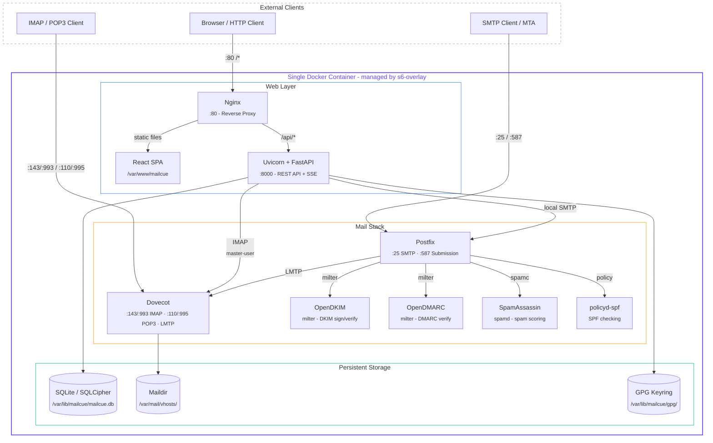

# Architecture

How MailCue runs as a single Docker container, plus the libraries and services it is built from.

## Architecture

**Request flow:** Nginx serves the React SPA for all non-API routes and proxies `/api/*` to Uvicorn. The FastAPI backend talks to Dovecot via IMAP (using a master-user credential for mailbox impersonation) and to Postfix via local SMTP. All services are supervised by s6-overlay, which handles startup ordering and automatic restarts.

## Tech Stack

### Backend

- **Python 3.12** with **FastAPI** and **Uvicorn** (async)
- **SQLAlchemy 2** (async) + **aiosqlite** (SQLite by default, swappable to PostgreSQL)
- **Alembic** for database migrations
- **Argon2id** password hashing, **JWT** (HS256) authentication
- **aioimaplib** and **aiosmtplib** for async IMAP/SMTP operations
- **python-gnupg** for GPG key management and PGP/MIME operations
- **sse-starlette** for Server-Sent Events

### Frontend

- **React 19** with **TypeScript**
- **Vite 8** build tool with SWC
- **Tailwind CSS 4** for styling
- **TanStack React Query** for server-state management
- **React Router 7** for client-side routing
- **Tiptap** rich text editor for composing HTML emails
- **Zustand** for UI state
- **Zod** + **React Hook Form** for validation

### Infrastructure

- **Postfix**: SMTP server (ports 25 and 587)
- **Dovecot**: IMAP/POP3/LMTP server (ports 143, 993, 110, 995)
- **OpenDKIM**: DKIM signing and verification
- **OpenDMARC**: DMARC policy verification (milter)
- **SpamAssassin**: Spam scoring and filtering
- **postfix-policyd-spf-python**: SPF record verification
- **Nginx**: Reverse proxy and static file server
- **s6-overlay v3**: Process supervisor (PID 1)
- **SQLCipher**: Optional AES-256 database encryption (drop-in SQLite replacement)
- **Debian Bookworm** slim base image
